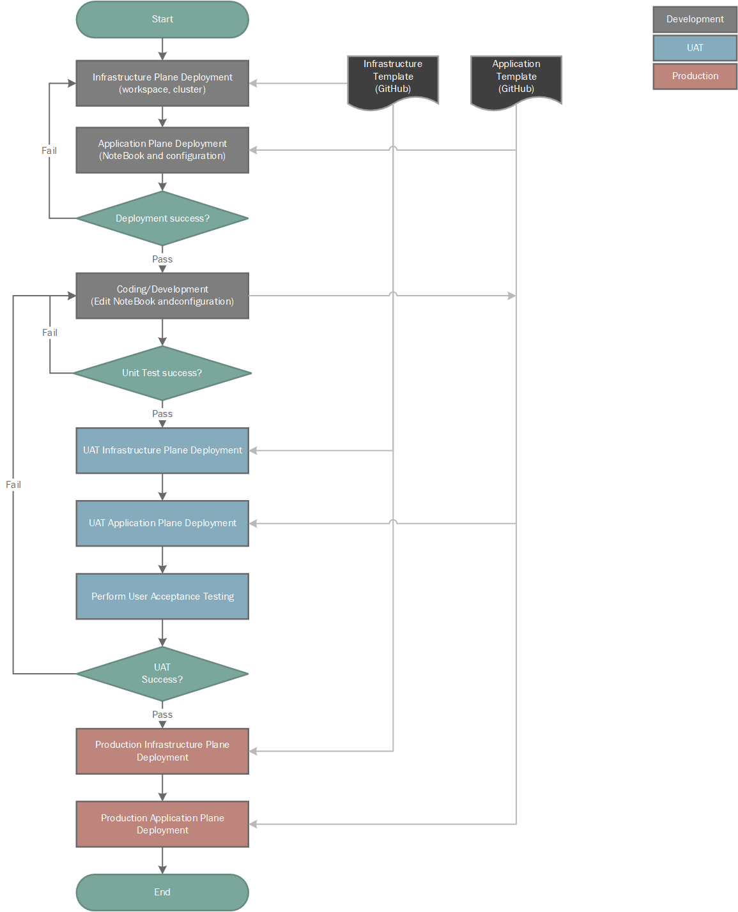
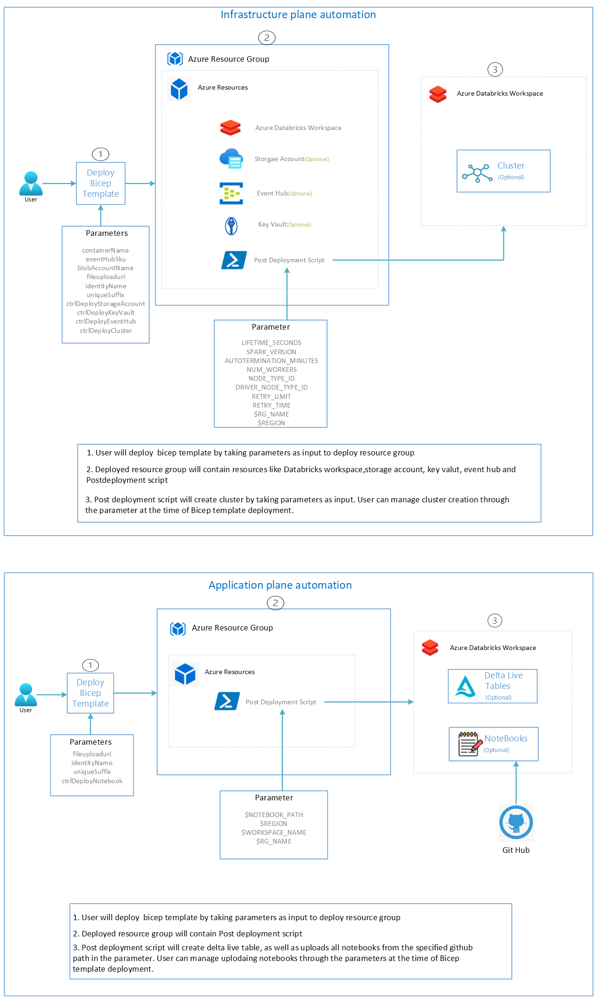

# Azure Databricks

This 1-click deployment allows the user to deploy environment of Azure Databricks with cluster, pipeline and notebook and other necessary infrastructure resources.

## SDLC Flow



## Infrastructure and Application Plane Flow



## Prerequisites For Deployment

To deploy, you need **owner role** as we are assigning RBAC roles and write access on the resources you're deploying and access to all operations on the Microsoft.Resources/deployments resource type.

## Network Access
 
Network Access configuration is enabled using below mentioned approach based on the Azure Resource Manager parameter value **Endpoint Type**.
- **Public** - Here, all the deployed resources are accessed publically including databricks workspace, cluster, ADLS gen 2 etc. No private link configuration. 
- **Private** – All the resources (ADLS storage gen2, key vault, event hub) along with databricks (Both front-end and back-end) will be on private link. Downside to this approach will be as Front-end connectivity(databricks workspace, API etc) is locked down to require private link, we cannot use Azure Resource Manager deployment script to carry out post deployment activities like cluster deployment, importing artifacts etc. All these activities should be carried out by running post deployment script in Azure CLI/Powershell on virtual machine/bastion in vnet environment.
- **Hybrid** – (Default approach choosen) , **Recommended when infrastructure automation is in place**. Here databricks would have public access along with private link configuration, since Front-end (databricks workspace, API etc) will be accessed publicly so automation of post deployment script execution is achieved, and back-end can only be accessed privately. Rest of the other resources (ADLS storage gen2, key vault, event hub) will also be accessed privately.

## Deployment Steps

1. Click **'Deploy To Azure'** button given below to deploy all the resources.

[](https://portal.azure.com/#blade/Microsoft_Azure_CreateUIDef/CustomDeploymentBlade/uri/https%3A%2F%2Fraw.githubusercontent.com%2FDatabricksFactory%2Fdatabricks-migration%2Fdev%2Fmain.json/uiFormDefinitionUri/https%3A%2F%2Fraw.githubusercontent.com%2FDatabricksFactory%2Fdatabricks-migration%2Fdev%2Fmainui.json)


Provide the values for the following parameters or default values will be considered:
- Resource group (create new) 
- Region (Default value is 'east us')
- Databricks Workspace Name (Default value is 'default')
- Databricks Pricing Tier (Default value is 'Premium')
- ADLS storage account name (Default value is 'adls')
- Option (true/false) for Key Vault deployment (Default value is true)
- Option (true/false) for Event Hub deployment (Default value is false)
- Eventhub Pricing Tier (Default value is 'Standard')
- Option (true/false) for Deploy Databricks Cluster (Default value is false)
- Cluster name (Default value is 'dbcluster')
- Spark Version (Default value is '11.3.x-scala2.12')
- Auto Termination Minutes(cluster) (Default value is 30)
- Num Workers (Default value is 2)
- Node Type Id (Default value is 'Standard_DS3_v2')
- Driver Node Type Id (Default value is 'Standard_DS3_v2')
- Quickstart source template option (Default value is 'RawFileSource') - Select which source notebook to be imported from the syntax parameter you selected above
- Quickstart source template syntax (Default value is 'DeltaLiveTable') - Select either DeltaLiveTable or DeltaTable syntax notebooks to be imported
- Deploy lakehouse samples (Default value is false) - Give true value if you want sample notebook examples to be imported
- Sample (Default value is RetailOrg) - Select type of samples
- Option (PublicMode/PrivateMode/HybridMode) for Endpoint Type (Default value is 'PublicMode') - Here ```PublicMode``` is public endpoint deployment, ```PrivateMode``` is private endpoint deployment and ```HybridMode``` is private endpoint hybrid deployment. Please select the endpoint according to your requirements.
- Nsg Name (Default value is 'databricks-nsg')
- Private Subnet Cidr (Default value is '10.179.0.0/18')
- Private Subnet Name (Default value is 'private-subnet')
- Public Subnet Cidr (Default value is '10.179.64.0/18')
- Private Endpoint Subnet Cidr (Default value is '10.179.128.0/24')
- Public Subnet Name (Default value is 'public-subnet')
- Required Nsg Rules (Default value is 'NoAzureDatabricksRules')
- Vnet Cidr (Default value is '10.179.0.0/16')
- Vnet Name (Default value is 'databricks-vnet')
- Private Endpoint Subnet Name (Default value is 'default')

2. Click **'Review + Create'**.

3. On successful validation, click **'Create'**.

## Post Deployment

The **OneClickDeploy.ps1** is the post deployment script used to deploy a **Cluster**, import **notebooks**, create a **pipeline** and upload files to storage account in the Databricks Workspace.
- The script contains the code to create an all-purpose cluster in databricks workspace if you choose **Ctrl Deploy Cluster** parameter as **true**.
- The script will import the notebooks into workspace from **Artifacts** folder from the GitHub repo based on your input.
- And the script will also create a pipeline/workflow if you choose **Ctrl Deploy Pipeline** parameter as **true**.
- Script will also import Notebooks from **Artifacts/Example/** folder from Git repo to workspace.
- Also the files from **data** folder from git repo will be uploaded to data container in storage account.

If you choose **false** for the above parameters or if you choose for Private mode deployment, you have to run the script manually in Azure CLI/Powershell by passing the required parameters explicitly or create them using Databricks workspace Interface. 

## Unity Catalog

Unity Catalog provides centralized access control, auditing, lineage, and data discovery capabilities across Azure Databricks workspaces.

In Unity Catalog, the hierarchy of primary data objects flows from metastore to table or volume:

* Metastore: The top-level container for metadata. Each metastore exposes a three-level namespace (catalog.schema.table) that organizes your data.
* Catalog: The first layer of the object hierarchy, used to organize your data assets.
* Schema: Also known as databases, schemas are the second layer of the object hierarchy and contain tables and views.
* Volume: Volumes sit alongside tables and views at the lowest level of the object hierarchy and provide governance for non-tabular data.
* Table: At the lowest level in the object hierarchy are tables and views.

### Unity Catalog Metastore Creation

User must be an **Azure Databricks account admin** to run the ```metastoredeploy.ps1``` script which creates metastore and assigns workspace.

Please run the [metastoredeploy.ps1](https://raw.githubusercontent.com/DatabricksFactory/databricks-migration/dev/metastoredeploy.ps1) script in Azure CLI/Powershell by passing two parameters: Resource group name and metastore name.

For Creating **Catalog**, **Schema**, **Table** and **Granting permissions**, Please refer to ```Unity-Catalog.ipynb``` notebook which is being imported to Databricks worskpace inside ```Shared``` folder.

## Azure Key Vaults: Assign Access Policies to Owner using PowerShell

Please run the [azure-key-vaults-assign-access-policies.ps1](https://raw.githubusercontent.com/DatabricksFactory/databricks-migration/dev/azure-key-vaults-assign-access-policies.ps1) script in Azure CLI by updating with key vault name and user email id. The script will assign all the **Key permissions** and ```Set```, ```Get```, ```List```, ```Delete``` **Secret permissions** to the user.

## Connect to Azure Data Lake Storage Gen2 or Blob Storage using Azure credentials

**OAuth 2.0 with an Azure service principal**: Databricks recommends using Azure service principals to connect to Azure storage. To create an Azure service principal and provide it access to Azure storage accounts please refer **Steps** folder document.

## Adding a user interface to ARM templates

Azure allows you to create a “UI definition” json file to define how you would like your ARM template to look like, you can define textboxes, dropdown lists , sections,….etc to gather user input and parameters to feed into your ARM template. We have included "mainui.json" file as UI defination for our ARM template.
If there is any change in the parameter in ARM template then we need to modify the UI defination accordingly.

## Azure Services being deployed

1. Databricks Workspace
2. Eventhub
3. ADLS Gen 2 Storage account with a Container data and csv files uploaded in it.
4. Key Vault
5. Network Interface
6. Network security group
7. Private DNS zone
8. Private endpoint
9. Virtual network
10. Databricks workspace will have a Cluster, Notebooks and Pipelines.
