## App registration process

By **registering an app** in **Azure Active Directory** provides you with Application ID which can be used in client application's *(here, Databricks)* 
authentication code. 

1.	Go to **Azure Active Directory** and click on **App Registrations** under **Manage** on the left pane.
3.	Now click on **"+ New Registration"** to create a new **App Registration**.

    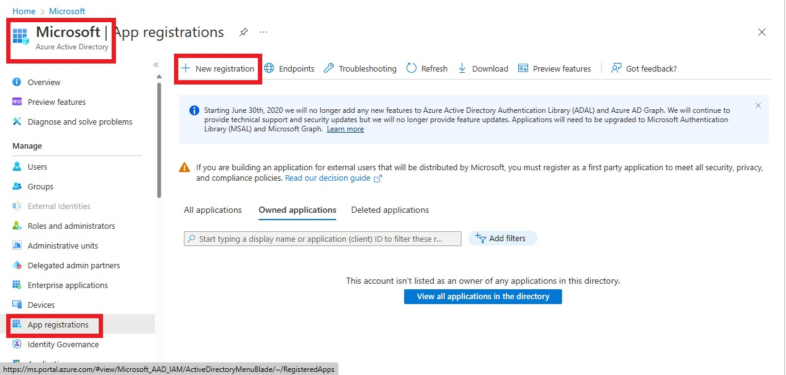

5.	Give the name as ``app_registration_dblab`` and click on **Register**.

    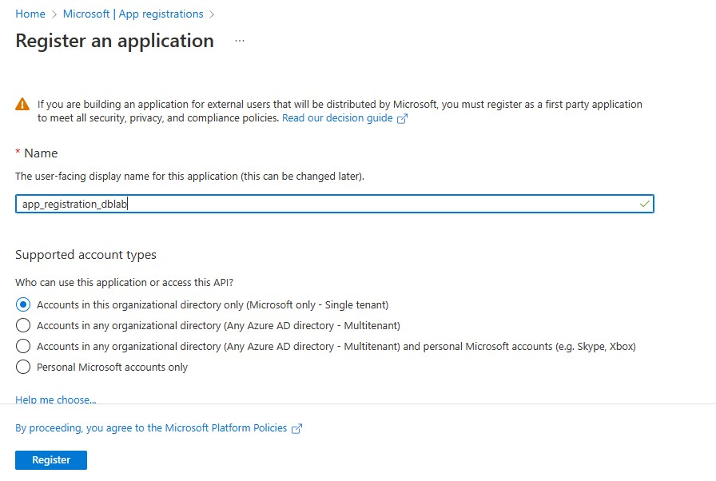

7.	Once created, copy the **Client ID** and **Directory ID** from the overview page to a notepad for future reference.

    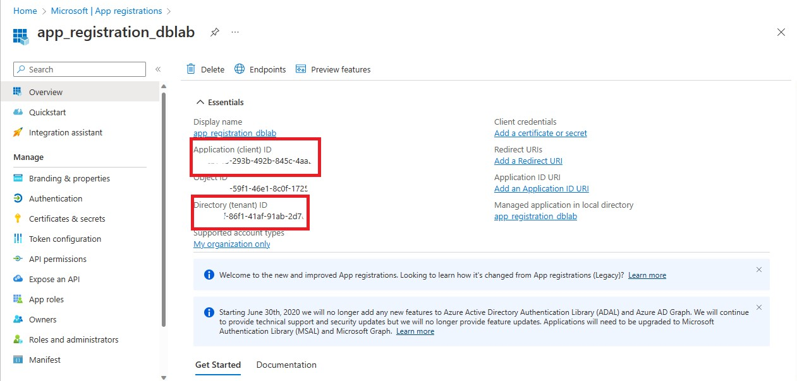

9.	Now click on **Certificates and secrets** under the **Manage** in the left pane.
11.	Create a new **Client Secret** by naming it ``client_secret_dblab`` and click on **Add**.
15.	Once done, copy the **Client Secret Value** for future reference.

    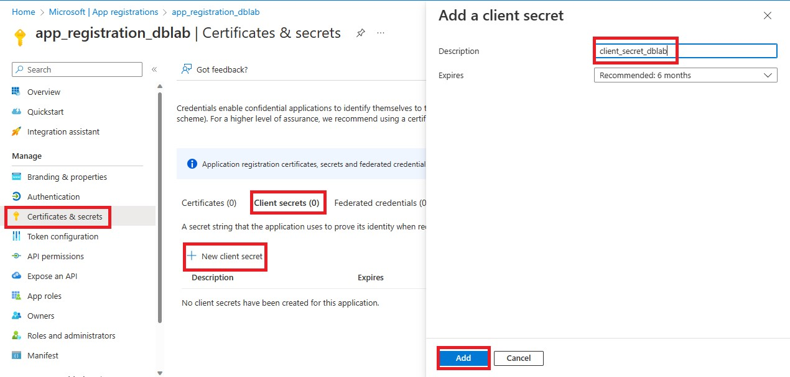
    
    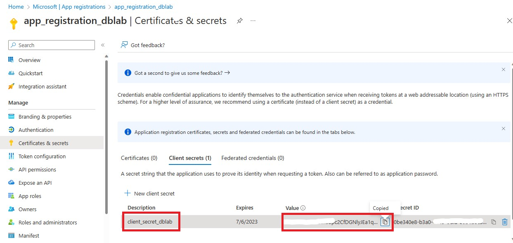
    
17.	  Go to your storage account.  
      **adls-{Random-String}** --> **Access Control** in the left pane -- > **Add role assignment**  
      
      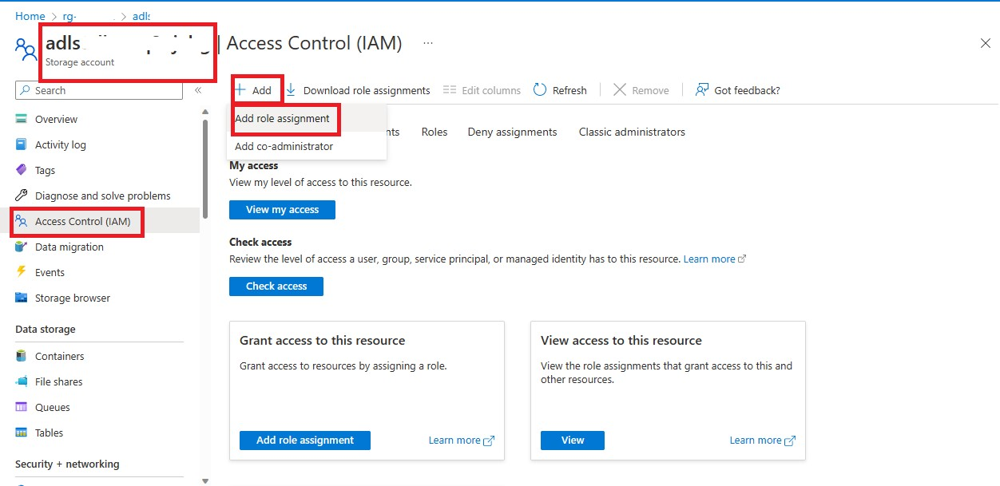
      
18. Search for **Storage Blob Data Contributor** --> Next --> Select **Members** --> Search for **app_registration_dblab** --> Select --> Review and Assign.
    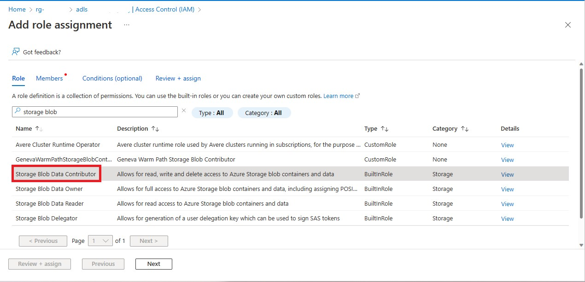
      
    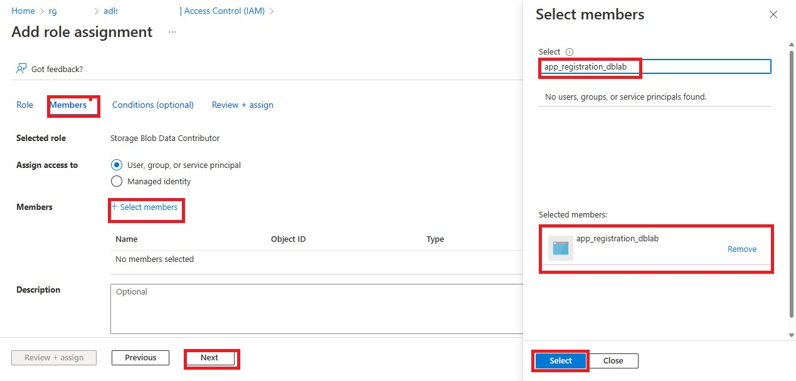
    
    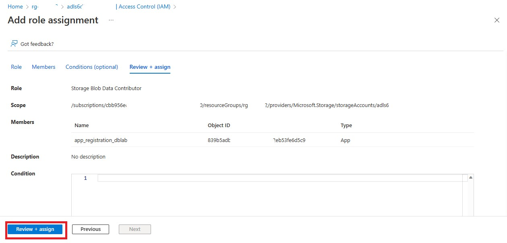
    
19.	Go to your Key Vault which goes by the name **keyvault{utcNow}** present in your resource group and click on **Access Policies** in the left pane. **Create** a new access policy for the app_registration_dblab.
    
    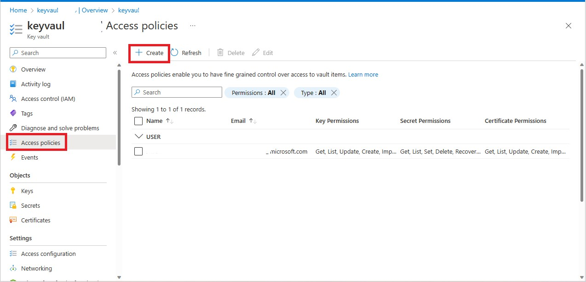
    
22. Select **Get** and **List** under *Key permissions* and *Secret permissions*.
    
    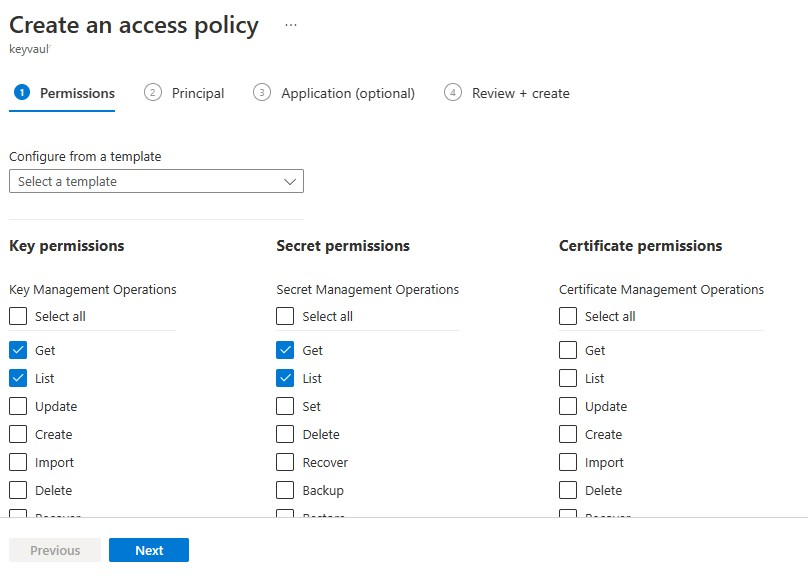
    
21. Select **app_registration_dblab** in *Principal* tab.
    
    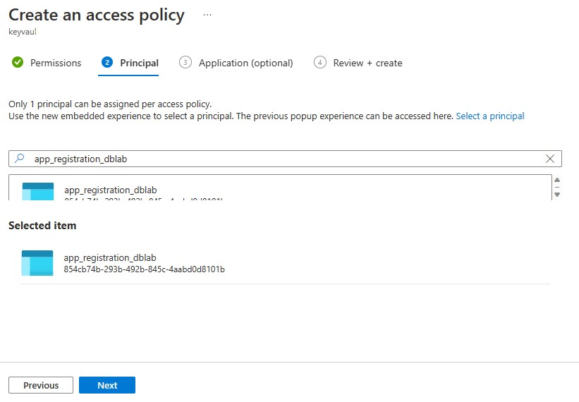
    
23. Review and create.
    
    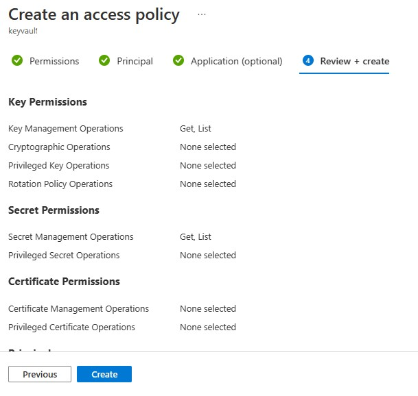
    
25.	  Go to **Secrets** under *Objects*. Click on **+Generate/Import** and fill in the following details:  
      **Name** – ``secret``  
      **Secret value** – The Client Secret Value that you had copied earlier. (Refer Step 7)
      And click create.

      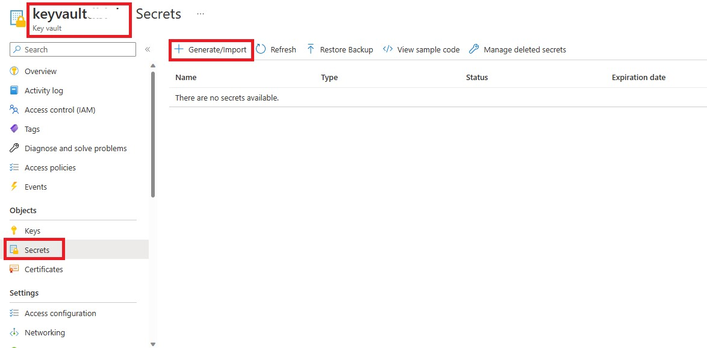
      
      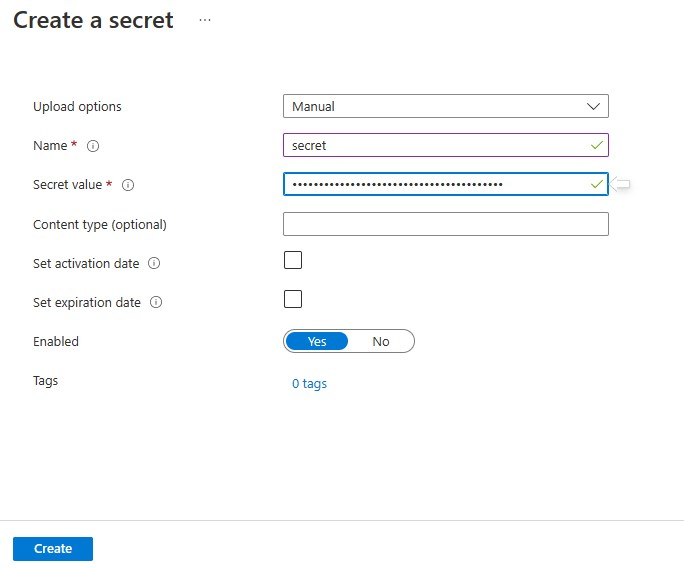
    
11.	Go to your resource group and open the **Databricks Workspace** which goes by the name {databricks-{randomstring}}.
13.	Edit the URL of the workspace as ``https://adb.......azuredatabricks.net/#secrets/createScope``.

    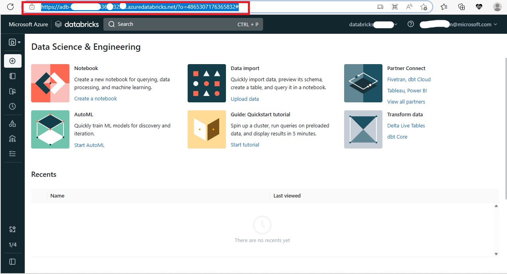
    
    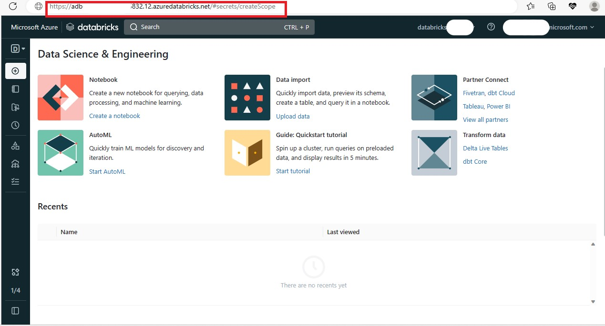
    
15.	  You should see the **Create Secret Scope** page. Fill in the following details and click on Create.  
      **Scope Name** – ``keyvaultdb``  
      **DNS Name** – Go to your resource group, **Key Vault** --> Click on **properties** under Settings --> copy the **Vault URI** and paste it.  
      **Resource** -  Go to your resource group, **Key Vault** --> Click on **properties** under Settings --> copy the **Resource ID** and paste it.  

      
      
      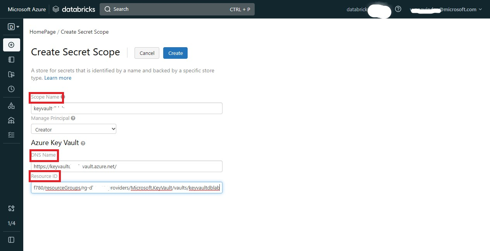
      
      Click **Ok** in the below pop-up.
      
      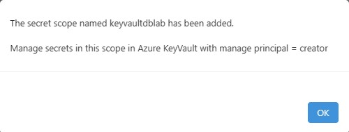
  
