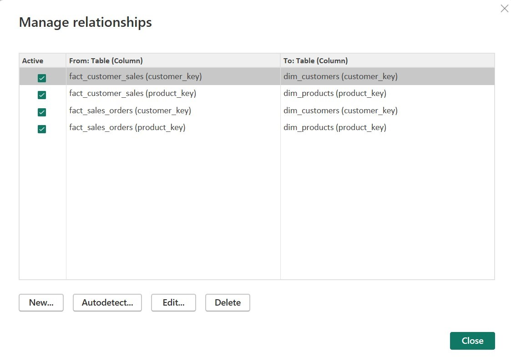

## End to End process for retail org

1.	In steps 2-12, we connect our storage accounts to our Databricks workspace. Refer [this document](https://github.com/DatabricksFactory/databricks-migration/blob/dev/steps/access_storage_with_AAD.md) for detailed instructions.
2.	Create a new **App Registration**.
3.	Make a note of *Client ID* and *Directory ID* for future reference.
4.	Create a new **Client Secret**.
5.	Copy the *Client Secret* Value for future reference.
6.	Add a **role assignment** to your ADLS storage account and Blob Data storage account. Give **Storage Blob Data Contributor** access to your app registration.
7.	Create a new **Access Policy** in the Key Vault to give *Get* and *List* permissions to your app registration.
8.	Run the [azure-key-vaults-assign-access-policies.ps1](https://raw.githubusercontent.com/DatabricksFactory/databricks-migration/dev/azure-key-vaults-assign-access-policies.ps1) script in Azure CLI by updating with key vault name and user email id.
9.	Change the Firewall rule of Key Vault to ***“Allow public access from all networks”*** in Networking.
10.	Generate a **Secret** in the Key Vault for the *Client ID value* that you copied earlier.
11.	Launch the Databricks Workspace and edit the URL as follows https://adb.......azuredatabricks.net/#secrets/createScope
12.	Fill in the details as follows :  
Scope Name – `keyvaultdb`  
DNS Name – Key Vault &#8594; Properties &#8594; Vault URI  
Resource - Key Vault &#8594; Properties &#8594;  Resource ID  
13.	Start the Cluster.
14.	Edit the **blob_to_adls_copy** notebook as follows.  
•	Replace *databricksscopename* in cmd2 with your scope name.  
•	Replace *databricksservicekey* in cmd2 with the name of the secret in the Key Vault.  
•	Replace the *Client ID* with your client ID in cmd 2 and cmd3.  
•	Replace the *Directory ID* with your directory ID in cmd 2 and cmd3.  
•	Replace the *blob storage account name* and *container name* in the cmd2 and cmd4 with your Blob Storage Account name.  
•	Replace the *ADLS storage account name* and *container name* in the cmd3 and cmd4 with your ADLS Storage Account name.  
15.	Run the Job **blob_to_adls_copy**.
16.	Edit the **bronze-layer-notebook** notebook as follows:  
•	Replace *databricksscopename* in cmd2 with your scope name.  
•	Replace *databricksservicekey* in cmd2 with the name of the secret in the Key Vault.  
•	Replace the *Client ID* with your client ID in cmd 2.  
•	Replace the *Directory ID* with your directory ID in cmd 2.  
•	Replace the *ADLS storage account name* and *container name* in the cmd2 and cmd3 with your ADLS Storage Account name.  
17.	 Run the Job **retail_org_batch_dlt**.
18.	 Goto Cluster and in the libraries section click on “Install new”. Select Maven and use below coordinates to install.
       ``com.microsoft.azure:azure-eventhubs-spark_2.12:2.3.22``
       
19.	Edit the **bronze_silver_gold_stream** notebook as follows:  
•	Replace the Event hub connection string.  
•	Replace the database name as ``retail_org_batch`` in all the cells where present.  

20.	Edit the **publish_events-eventhub** notebook as follows:  
•	Change the abfss configuration as done before in the bronze-layer-notebook.  
•	Replace the account name of the json_file_path in the cmd4.  
•	Replace Event hub connection string  
•	Replace event hub name  

21.  Run the Job **retail_org_stream**
22.  Goto Cluster and select JDBC/ODBC under advance setting. Copy Server Hostname and HTTP Path for reference in Power BI. 

## Power BI Reporting for retail org
1. Install Power BI Desktop on your machine.
2. Download the "dim_fact_PBI_report_query.pbix" file from [this location](https://github.com/DatabricksFactory/databricks-migration/blob/dev/docs/dim_fact_PBI_report_query.pbix)

3. If Promted Login with you v- credentials
4. Delete all the tables from the Data section.
5. Click on Get data and select Azure Databricks
6. Enter Server Hostname and HTTP Path as copied before
7. Select DirectQuery as Data Connectivity Mode and then click ok
8. Select Azure Active directory and sign in with your v- ID and connect.
9. Now select 4 tables (dim_customers, dim_products, fac_sales_order, fact_customer_sales) from hive_metastore > retail_org_batch
10. Click on Load
11. Goto Model and create relationships between tables as below : 

12. Go Back to Report View and check the reports.

